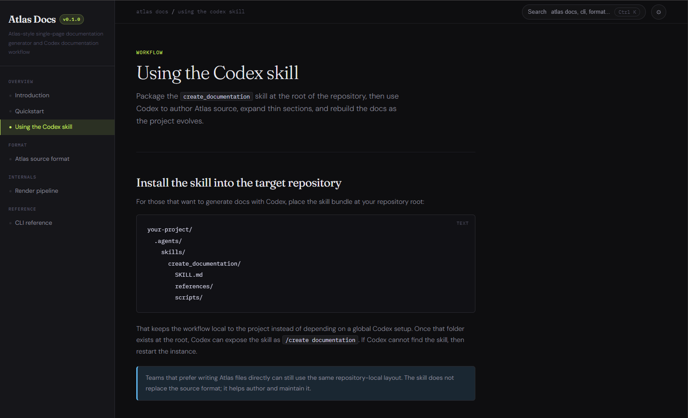

# Atlas Docs

Atlas Docs is a Markdown-based static site generator for documentation, paired with a Codex workflow that turns project context into a polished docs site.


**^ Generate docs like these ^**

The repository has two related parts:

- `src/atlas_docs/`: the reusable Python package and CLI
- `ATLAS_DOCS_FORMAT.md`: the source format the generator compiles

The Codex skill for this workflow is named `create-documentation`. When packaged for Codex, it is intended to be a standalone bundle that includes its own `SKILL.md`, references, and vendored `atlas_docs` scripts.

## What It Does

Given an Atlas source directory, the CLI builds a browsable static HTML documentation site.

The `create-documentation` skill sits one layer above that. It is meant to:

- inspect a local repository or research a non-local project
- write Atlas source files such as `metadata.md`, `navigation.md`, `assets.md`, and `content/*.md`
- build a final `docs_site/index.html`

## Install The CLI

From the repository root:

```bash
py -m pip install -e .
```

That installs the `atlas-docs` command defined in `pyproject.toml`.

## CLI Usage

```bash
atlas-docs init my-docs
atlas-docs build my-docs --out dist/index.html --theme atlas_dark
atlas-docs serve my-docs --port 8000
```

If you do not want to install the package, you can run it from source:

```bash
set PYTHONPATH=src
py -m atlas_docs.cli build my-docs --out dist/index.html
```

## Atlas Source Layout

Atlas separates source content from rendering assets:

```text
docs/
  metadata.md
  navigation.md
  assets.md
  content/
    *.md
```

The format is defined in `ATLAS_DOCS_FORMAT.md`.

## Repository Layout

```text
src/atlas_docs/
  cli.py
  loader.py
  markdown.py
  renderer.py
  theme.py
  templates/
  themes/
  static/

ATLAS_DOCS_FORMAT.md
pyproject.toml
README.md
```

## Using The Skill

The intended Codex skill name is `create-documentation`.

Depending on the Codex surface, invocation may look like either of these:

```text
/create-documentation document this project
$create-documentation document this project
```

A packaged standalone skill bundle should contain:

```text
create-documentation/
  SKILL.md
  agents/openai.yaml
  references/ATLAS_DOCS_FORMAT.md
  references/atlas-workflow.md
  scripts/atlas_docs/
```

That bundle should use the vendored `scripts/atlas_docs` package so the skill remains portable instead of depending on this repository being installed in editable mode.
